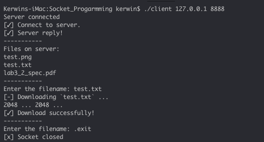

# Simple-File-Transfer

2019 NTHU Compyter Network Lab3 Sock programming.

It is a simple file Transfer using C language to implement.

## Install 

This project using meson to build, so you need to install meson first.

OSX:
```bash
$ brew install meson
```

Arch Linux:
```bash
$ sudo pacman -S meson
```

Other OS => see more https://mesonbuild.com/Quick-guide.html

Then you can build the main program.

```bash
$ cd src && meson build
$ ninja -C build
```

## Usage 

For Server we only need to give Port number.

```bash
$ ./build/server 8888
```

For Client we should give Server IP adderss and Server Port number.
In default case we put server in locahost <127.0.0.1>.

```bash
$ ./build/client 127.0.0.1 8888
```

```bash

Server connected
[✓] Connect to server.
[✓] Server reply!
-----------
Files on server:
test.png
test.txt
lab3_2_spec.pd
-----------
Enter the filename:
```

using `.exit` to exit

## Screen Shot

 
